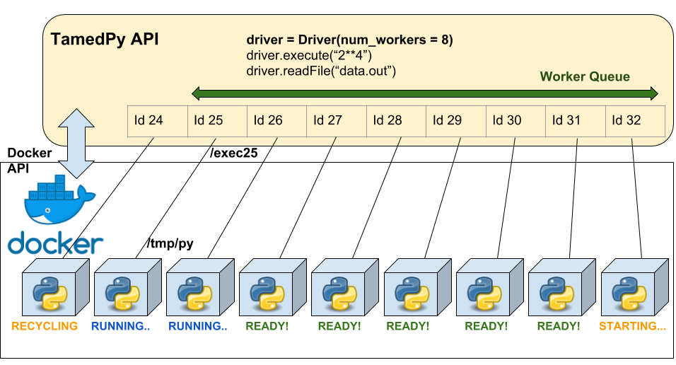

# TamedPy
Tamed Python - Sandboxed execution of arbitrary Python code

# Usage
```py
from tamedpy.sbc import SandboxedContext
with SandboxedContext() as sbc:
  code = 'print(2**4)'
  result = sbc.execute(code)
  print(result)
```

## Placing input files into Sandbox
```py
sbc.execute(code, ['path/to/inputfile1', 'path/to/inputfile2',])
```

## Reading files back from Sandboxed execution
```py
result = sbc.execute(code)
op = result.readFile('output.txt')
```

## Reading `stderr` from Sandboxed execution
```py
result = sbc.execute(code)
print(result.stderr())
```

## Specify number of workers
```py
with SandboxedContext(num_workers=6) as sbc:
  # do stuff
```

# Setup
System Dependencies: python2.7, virtualenv, pip, Docker

## Steps
Clone and `cd TamedPy`

In a python 2.7 env / virtualenv, install requirements.  
`pip install -r requirements`

Build docker image  
`docker build -t tamedpy tamedpy/container/`

Start using from within a python script / shell by importing `tamedpy.driver.Driver` or `tamedpy.sbc.SandboxedContext`

# Schematic Diagram


